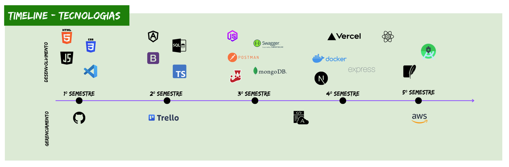

# Sobre o EcoVoucher

Apresentar uma solução economicamente viável para auxiliar no combate à fome, de maneira sustentável e, em conjunto com os Objetivos do Desenvolvimento Sustentável (O.D.S), buscar gerar valor através do EcoVoucher.
O EcoVoucher irá transformar a maneira de gerar valor à população através da reciclagem. Seu funcionamento é simples como demonstrado abaixo:
O cidadão coleta o resíduo reciclável, leva até um dos pontos de coleta, pontos esses que estarão distribuídos de maneira sistemática pela cidade, deposita o resíduo no equipamento, o equipamento realiza a análise do tipo e quantidade de cada item e, após computar, classificar e pesar os itens, devolve, em forma de crédito o valor computado. Os créditos poderão ser utilizados para comprar passagens de ônibus, comprar itens básicos de cesta de alimentos ou, até mesmo, abater em tributos municipais.

> [!NOTE]
> Projeto baseado na metodologia ágil SCRUM, procurando desenvolver a Proatividade, Autonomia, Colaboração e Entrega de Resultados dos envolvidos no projeto.

## Arquitetura

   
Diagrama de Caso de Uso

    

        
    

   
Diagrama de Classes

    

        
    

   
Requisitos Funcionais

    

        
    

   
Requisitos Não Funcionais

    

        
    

   
User Stories

    

        
    

## Apresentação
Confira a seguir uma demonstração das funcionalidades do site:

   
Cadastro

    

        
    

   
Login

    

        
    

## Sprints
Cada entrega foi realizada a partir da criação de uma **tag** em cada repositório (web e todos os microsserviços), além da criação de uma branch neste repositório com um relatório completo de tudo o que foi desenvolvido naquela sprint. Observe a relação a seguir:
| Sprint | Previsão | Status | Histórico |
|:--:|:----------:|:----------------|:-------------------------------------------------:|
| 01 | 27/05/2024 | ✔️ Concluída    | [ver relatório](https://github.com/Eng-FelipeA/EcoVoucher/blob/main/Documenta%C3%A7%C3%A3o/readme.md) |
| 02 | 10/06/2024 |  ✔️ Concluída    | [ver relatório](https://github.com/Eng-FelipeA/EcoVoucher/blob/main/Documenta%C3%A7%C3%A3o/sprint2.md) |
| 03 | 19/06/2024 |  ✔️ Concluída   | [ver relatório](https://github.com/Eng-FelipeA/EcoVoucher/blob/main/Documenta%C3%A7%C3%A3o/sprint3.md) |
| 04 | 15/10/2024 | ✔️ Concluída    | [ver relatório](https://github.com/marcusvsbarros/readMeTest/blob/main/Sprint4.md) |
| 05 | 28/11/2024 |  ✔️ Concluída    | [ver relatório](https://github.com/marcusvsbarros/readMeTest/blob/main/Sprint5.md) |
| 06 | 02/12/2024 |  ✔️ Concluída   | [ver relatório](https://github.com/marcusvsbarros/readMeTest/blob/main/Sprint6.md) |
| 07 | 20/05/2025 |  Em Andamento   | [ver relatório](https://github.com/marcusvsbarros/readMeTest/blob/main/Sprint6.md) |

  
→ [Voltar ao topo](#topo)

# Tecnologias Utilizadas

    

### **Frontend**

### **Backend**

### **Deploy/Versionamento**

# Equipe

|    Função     | Nome                                  |                                                                                                                                                      LinkedIn & GitHub                                                                                                                                                      |
| :-----------: | :------------------------------------ | :-------------------------------------------------------------------------------------------------------------------------------------------------------------------------------------------------------------------------------------------------------------------------------------------------------------------------: |
|   Scrum Master    | Felipe Afonso da Silva Vieira                 |       |
|   Developer    | João Pedro               |                  |
|   Developer    | Letícia Pinheiro                   |                  |
|   Product Owner    | Marcus Vinicyus Souza Barros                 |       |
| Product Owner  | Publio Moreira Gomes Ferreira |            |

                    
          
          
          
